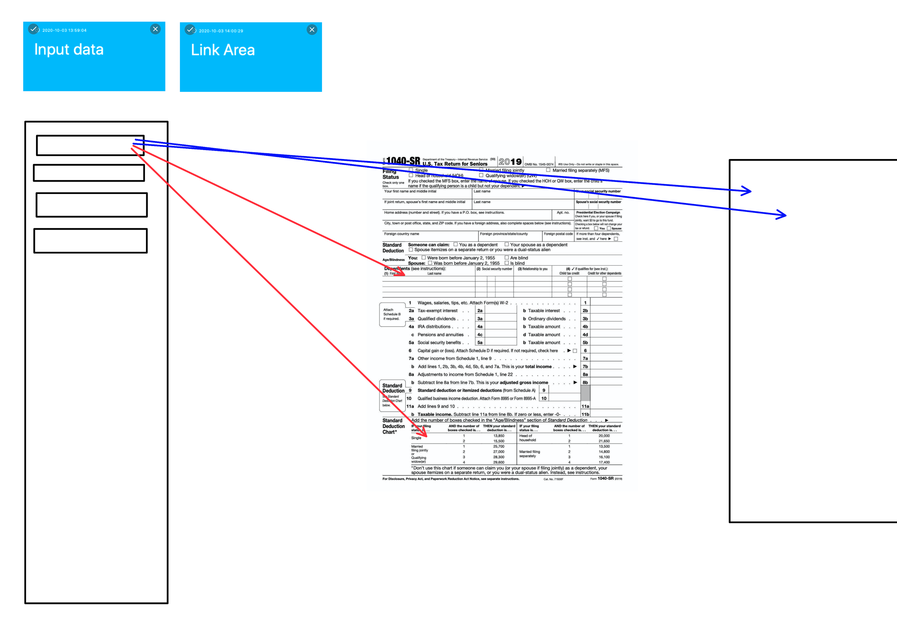

# Form Generator

###### We are aiming to create a input application, and render that data onto forms. Like the 1040, and attempt to "auto populate" the data.

## Team 8

# User Story
###### As a employee I need an application that assists with filling forms out
###### I need to be able to add data
###### so that I can render it in spacific places on any form

### Profile: https://github.com/kaurshalpreet

1. License:
   MIT

1. Installation: 
   npm install

1. Usage: 
    Can only be used for non commercial purposes

1. Testing Methods: 
    We going to test this manually.

1. Contributors: 
    Ian N Astesana, Shalpreet Kaur, Audra Dagenais, Javier Alba

###### If you have any questions reach out to me by email. iastesana@gmail
    
##### undedecided API
##### Tasks will be decided at time of decision.

