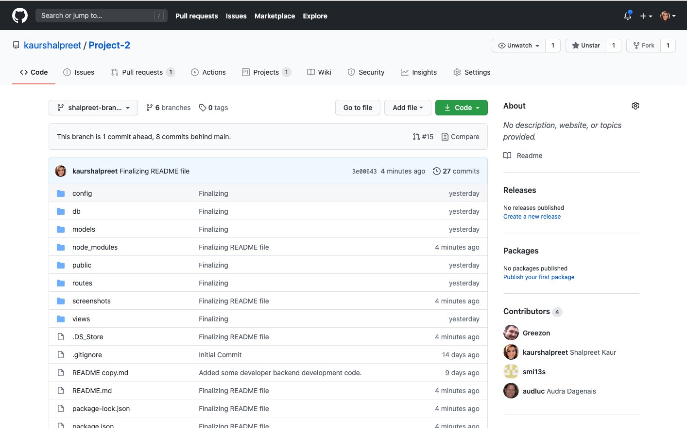
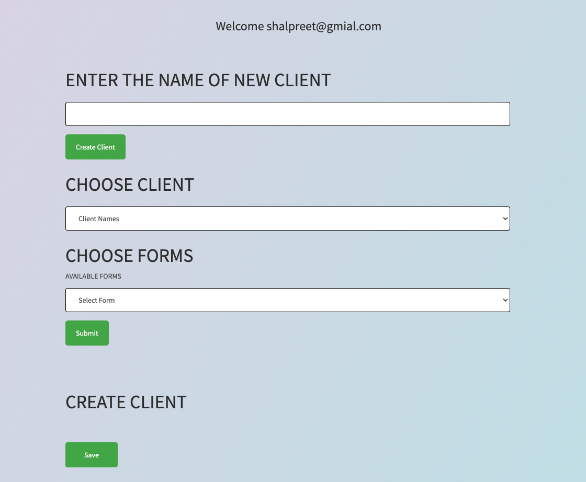

# Form-Generator

## Description

Form Generator is an app used to generate a form for a client by pulling out information stored in database or adding a client's information and store in database for future use. In our project we have used the DMV form and 1040 form.  
Created with Sequelize, Node, Express and Handlebars. Handlebars is used to generate the HTML page. Node and Sequelize is used to query and route data in the app. 
 

[The Link to My Github Repository](https://github.com/audluc/Project-2)

---

## Table of Contents

1. [Installation](#Installation)
1. [Usage](#Usage)
1. [Contributors](#Contributors)
1. [Credits](#Credits)
1. [License](#License)

---

## Installation

npm init  
npm i express  
npm i express-handlebars  
npm i sequelize  
npm i express-session  
npm i bcryptjs  
npm i jspdf  

---

## Usage

 Form Generator is an app that is useful in filling up various forms by pulling the data from the SQL database.
Once the app is launched the user will have to either sign up for an account or if the account already exists, they will have to use their existing account to login. Once the login is successful then the user will be presented with an option to enter the name of a new client and create it. Once the new client is created it will be added to the drop-down list under the Choose Client section. From the Choose client section the user can select an existing user. Then the user can choose the type of form to be generated and hit submit button. Once the submit button is hit it is going to pull up the data from the database and show it on the HTML page. The user can then verify the information on the displayed form and click on save button. Once the save button is clicked it will generate the selected form in pdf format and will also save/update the Client Record in the database. 

 [The link to the deployed app to Heroku](https://ancient-earth-94263.herokuapp.com/)

A Screenshot of the app is shown below.

---

## Contributors

Ian Astesana -
Github: Greezon

Javier Alba - 
Github: smi13s

Audra Dagenais - 
Github: audluc

Shalpreet Kaur - 
Github: kaurshalpreet

---

## Credits

- UC Davis BootCamp - Instructors and TAs
- https://www.w3schools.com/
- https://www.youtube.com/
- https://www.google.com/
- https://choosealicense.com/licenses/
- https://shields.io/category/license

---

## License

#### This application is licensed under the [MIT License](https://opensource.org/licenses/MIT)

---

## Questions

#### You can reach me via my [Github](https://github.com/audluc) account.

#### Email me with any additional questions at: audluc44@gmail.com